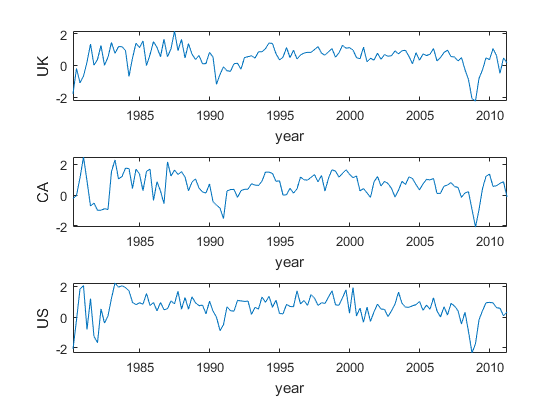

[](http://quantlet.de/)

## [](http://quantlet.de/) **SSM_TsayEx23_d** [](http://quantlet.de/)

```yaml

Name of QuantLet: SSM_TsayEx23_d

Published in: Linear Time Series With MATLAB and Octave

Description: 'A VAR(2) model is estimated. This is Example 2.3 in Tsay (2014).'

Keywords: time-series, VAR model, OLS estimation, t-values, OLS residuals

Author: Víctor Gómez

Submitted: Wed, December 19 2018 by Víctor Gómez

```



### MATLAB Code
```matlab

%script file for example 2.3 in Tsay (2014)
%

data = load(fullfile('data', 'q-gdp-ukcaus.dat'));
gdp = log(data(:, 3:5));

z = diferm(gdp, 1); % Growth rate
z = z * 100; % Percentage growth rate
[nx, mx] = size(z);
tdx = [1:nx] / 4 + 1980; %time index

subplot(3, 1, 1)
plot(tdx, z(:, 1))
xlabel('year');
ylabel('UK');
axis('tight');
subplot(3, 1, 2)
plot(tdx, z(:, 2))
xlabel('year');
ylabel('CA');
axis('tight');
subplot(3, 1, 3)
plot(tdx, z(:, 3))
xlabel('year');
ylabel('US');
axis('tight');
disp('press any key to continue')
pause
close all

disp(' ')
disp('estimation of a VAR(2) model for the series')
disp('')
disp('press any key to continue')
pause

%estimate VAR(2)
nlag = 2;
res = var_est(z, nlag);

disp(' ');
disp('***** Estimated VAR Model  *****');
disp(' ');
clear in
in.fid = 1;
in.fmt = char('%12.4f');
tit = 'AR';
strt = 1;
mprintar(res.phi(:, :, 2:3), in, tit, strt);
disp(' ')
tit = 'Constant';
mprintar(res.const', in, tit);

disp(' ');
disp('***** Estimated t-values  *****');
disp(' ');
clear in
in.fid = 1;
in.fmt = char('%12.4f');
tit = 'tv-AR';
strt = 1;
mprintar(res.phitv(:, :, 2:3), in, tit, strt);
disp(' ')
tit = 'tv-Constant';
mprintar(res.consttv', in, tit);
disp(' ');
tit = 'Sigma:';
mprintar(res.sigmar, in, tit);

```

automatically created on 2019-02-11