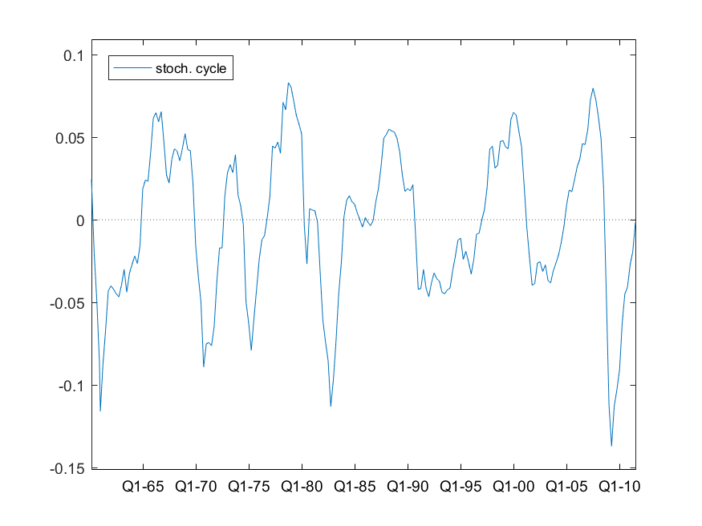

[](http://quantlet.de/)

## [](http://quantlet.de/) **SSM_USIPIstscl_d** [](http://quantlet.de/)

```yaml

Name of QuantLet: SSM_USIPIstscl_d

Published in: Linear Time Series With MATLAB and Octave

Description: 'A cycle is estimated for the quarterly IPI series of USA using a structural model.'

Keywords: time-series, ARIMA model, structural model, cycle, unobserved components

Author: Víctor Gómez

Submitted: Thu, January 24 2019 by Víctor Gómez

```



### MATLAB Code
```matlab

%%%%%%%%%%%%%%%%%%%%%%%%%%%%%%%%%%%%%%%%%%%%%%%%%%%%%%%%%%%%%%%%
%
% US Industrial Production Index, 1946-I, 2011-III
% A univariate structural model is specified and estimated. It includes a
% cyclical component and an outlier (LS). The outlier is assigned to the
% trend.
%%%%%%%%%%%%%%%%%%%%%%%%%%%%%%%%%%%%%%%%%%%%%%%%%%%%%%%%%%%%%%%%%

clear;
clc;

%model estimation
%the outlier is incorporated to the trend through the field Ycomp of
%structure ser in the specification file usmUSIPI
out = usmestos('usmUSIPI');

```

automatically created on 2019-02-11