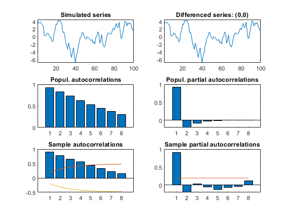
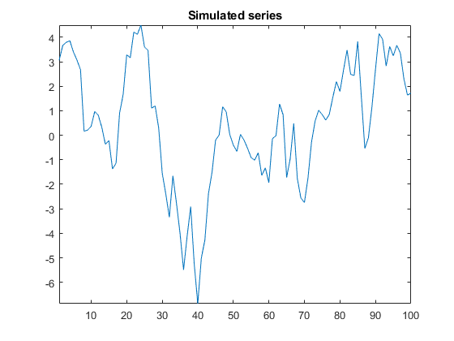

[](http://quantlet.de/)

## [](http://quantlet.de/) **SSM_arimasimul2_d** [](http://quantlet.de/)

```yaml

Name of QuantLet: SSM_arimasimul2_d

Published in: Linear Time Series With MATLAB and Octave

Description: 'A series following an ARMA(2,1) is simulated and the theoretical and sample autocorrelations and partial autocorrelations are computed.'

Keywords: time-series, ARIMA model, autocorrelations, partial autocorrelations, simulation

Author: Víctor Gómez

Submitted: Wed, December 19 2018 by Víctor Gómez

```





### MATLAB Code
```matlab

% script file to simulate a series that follows an ARMA(2,1) series.
% Example in Section 2.1.1 of the book 'Linear Time Series With MATLAB and
% OCTAVE'
%
clear

freq = 1;
phir = [-.8, 1];
phir = conv(phir, [-.7, 1]);
thr = [-.4, 1];

y = arimasimeasy(freq, '[p dr q]', [2, 0, 1], '[ps ds qs]', [0, 0, 0], ...
    'phir', phir, 'thr', thr, 'N', 100, 'discard', ...
    50, 'seed', 20, 'gft', 1);

plot(y);
title('Simulated series');
axis('tight');

```

automatically created on 2019-02-11