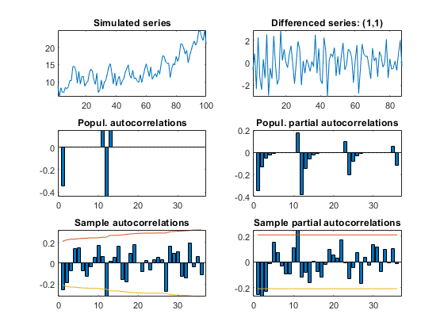
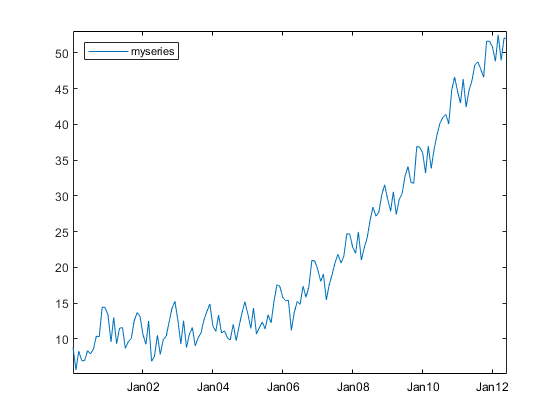
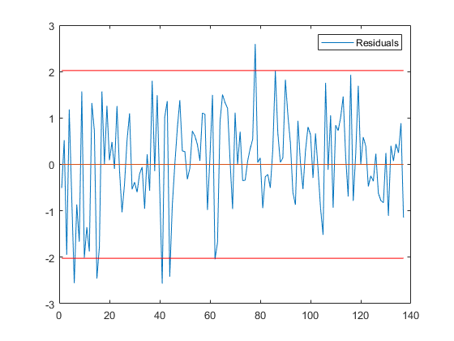
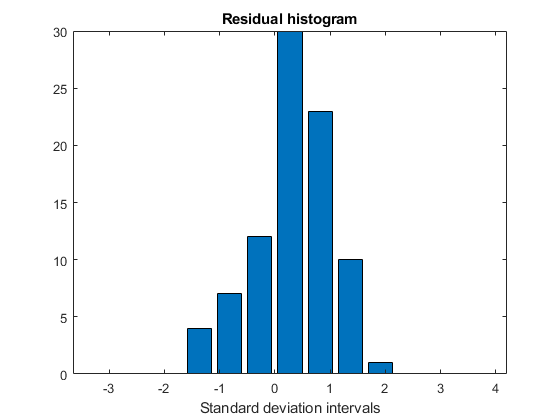
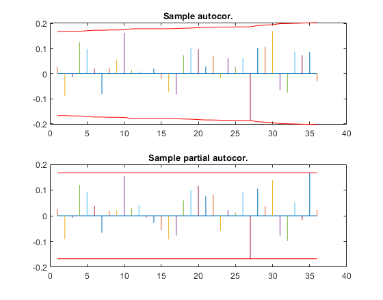
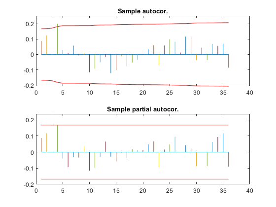

[](http://quantlet.de/)

## [](http://quantlet.de/) **SSM_arimasimul_d** [](http://quantlet.de/)

```yaml

Name of QuantLet: SSM_arimasimul_d

Published in: Linear Time Series With MATLAB and Octave

Description: 'Firstly, a time series following an ARIMA model is simulated. Then, the model is identified and estimated.'

Keywords: time-series, ARIMA model, simulation, estimation, seasonality

Author: Víctor Gómez

Submitted: Wed, December 19 2018 by Víctor Gómez

```













### MATLAB Code
```matlab

% script file to simulate a series that follows an ARIMA(p,d,q)(P,D,Q)
% model and compare the sample autocorrelation and partial autocorrelation
% functions of the differenced series with their theoretical counterparts.
% A mean for the differenced series can also be generated.

clear

freq = 12;

y = arimasimeasy(freq, '[p dr q]', [0, 1, 1], '[ps ds qs]', [0, 1, 1], ...
    'thr', [-.4, 1], 'ths', [-.6, 1], 'N', 100, 'gft', 1, 'drg', 1, 'dsg', 1);

%Identify and estimate the model
out = arimaeasy(y, freq, '[bg_year bg_per]', [2015, 1], 'gft', 3, 'sname', 'myseries');

```

automatically created on 2019-02-11