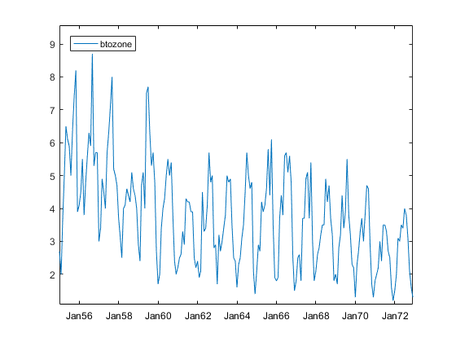
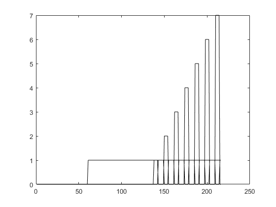

[](http://quantlet.de/)

## [](http://quantlet.de/) **SSM_btozoneprof_d** [](http://quantlet.de/)

```yaml

Name of QuantLet: SSM_btozoneprof_d

Published in: Linear Time Series With MATLAB and Octave

Description: 'An ARIMA model for the ozone series of Box and Tiao (1975) is identified using the BIC and AIC criteria, 
              both computed by means of the profile likelihood.'

Keywords: time-series, ARIMA model, identification, profile likelihood, AIC, BIC, information criteria

Author: Víctor Gómez

Submitted: Wed, January 9 2019 by Víctor Gómez

```





### MATLAB Code
```matlab

%Series is ozone series from Box and Tiao (1973)
clear

btoz = load(fullfile('data', 'btozone.dat'));
[nb, junk] = size(btoz);
nyb = nb - 12;
bg_year = 1955;
bg_per = 1;
freq = 12;
yor = btoz(1:nyb, 1);
Ya = btoz(1:nyb, 2:4);
ct = deltafil(Ya(:, 2:3), 0, 1, 0, 0, freq);
Y = [Ya(:, 1), ct];
x = [];
rnamesrg = [];
for i = 1:3
    rnamesrg = char(rnamesrg, ['int', num2str(i)]);
end

yor = log(yor);

%1) first model
p = 1;
d = 0;
q = 0;
ps = 0;
ds = 1;
qs = 1;
%estimate model using HR method
est = 1;
[yd, beta] = diffest(yor, Y, freq, 0, d, ds, 0, est); %differenced series
ydc = yd(:, 1) - yd(:, 2:4) * beta; %differenced corrected series

%estimate model using the differenced corrected series
[strv, ferror] = estvarmaxpqrPQR(ydc, x, freq, [p, q, 0], [ps, qs, 0], 0, 1, 1);

% define model. Model is (1,0,0)(0,1,1)_12
phi1(:, :, 1) = 1;
Phi1(:, :, 1) = 1;
Phi1(:, :, 2) = -1.;
th1(:, :, 1) = 1;
Th1(:, :, 1) = 1;
%no mean in the model

%setup model
phi1(:, :, 2) = strv.phis3(:, :, 2);
Th1(:, :, 2) = strv.thetas3(:, :, freq+1);
Sigma1 = strv.sigmar3;

%create structure and put model into innovations state space form
[str, ferror] = suvarmapqPQ(phi1, th1, Phi1, Th1, Sigma1, freq);

Z = str.Z;
G = str.G;
W = str.W;
T = str.T;
H = str.H;
nalpha = size(T, 1);
% ii=[0 0 0 nalpha]; ins=eye(nalpha);
ndelta = freq * ds + d; %number of unit roots
[ins, ii, ferror] = incossm(T, H, ndelta);
chb = 1;

%computation of the profile likelihood
X = Y;
% [e,f,hb,Mb,A,P,qyy,R,olsres]=scakfle2prof(yor,X,Z,G,W,T,H,ins,ii,chb);

[e2, f2, hb2, Mb2, A2, P2, qyy2, R2] = scakflepc(yor, X, Z, G, W, T, H, ins, ii, chb);
Ff = (e2' * e2) * f2^2;
%number of parameters
nr = 2;
nreg = 3;
dn = double(nyb); %information criteria
dnp = double(nr+nreg+nalpha);
aic1 = dn * (log(2*pi) + log(Ff)) + 2 * dnp;
bic1 = dn * (log(2*pi) + log(Ff)) + log(dn) * dnp;

%2) second model
p = 0;
d = 1;
q = 1;
ps = 0;
ds = 1;
qs = 1;
%estimate model using HR method
est = 1;
[yd, beta] = diffest(yor, Y, freq, 0, d, ds, 0, est); %differenced series
ydc = yd(:, 1) - yd(:, 2:4) * beta; %differenced corrected series

%estimate model using the differenced corrected series
[strv, ferror] = estvarmaxpqrPQR(ydc, x, freq, [p, q, 0], [ps, qs, 0], 0, 1, 1);

% define model. Model is (0,1,1)(0,1,1)_12
phi2(:, :, 1) = 1;
phi2(:, :, 2) = -1.;
Phi2(:, :, 1) = 1;
Phi2(:, :, 2) = -1.;
th2(:, :, 1) = 1;
Th2(:, :, 1) = 1;
%no mean in the model

%setup model
th2(:, :, 2) = strv.thetas3(:, :, 2);
Th2(:, :, 2) = strv.thetas3(:, :, freq+1);
Sigma2 = strv.sigmar3;

%create structure and put model into innovartions state space form
[str, ferror] = suvarmapqPQ(phi2, th2, Phi2, Th2, Sigma2, freq);

Z = str.Z;
G = str.G;
W = str.W;
T = str.T;
H = str.H;
nalpha = size(T, 1);
% ii=[0 0 0 nalpha]; ins=eye(nalpha);
ndelta = freq * ds + d; %number of unit roots
[ins, ii, ferror] = incossm(T, H, ndelta);
chb = 1;

%computation of the profile likelihood
X = Y;
% [e,f,hb,Mb,A,P,qyy,R,olsres]=scakfle2prof(yor,X,Z,G,W,T,H,ins,ii,chb);

[e2, f2, hb2, Mb2, A2, P2, qyy2, R2] = scakflepc(yor, X, Z, G, W, T, H, ins, ii, chb);
Ff = (e2' * e2) * f2^2;
%number of parameters
nr = 2;
nreg = 3;
dn = double(nyb); %information criteria
dnp = double(nr+nreg+nalpha);
aic2 = dn * (log(2*pi) + log(Ff)) + 2 * dnp;
bic2 = dn * (log(2*pi) + log(Ff)) + log(dn) * dnp;
disp('information criteria')
bic1
bic2
aic1
aic2

```

automatically created on 2019-02-11