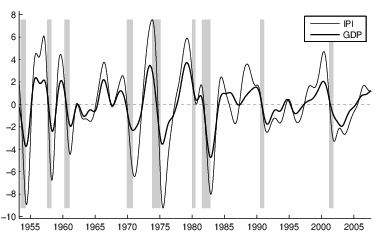

[](http://quantlet.de/)

## [](http://quantlet.de/) **SSM_mulcycus2wcv_d** [](http://quantlet.de/)

```yaml

Name of QuantLet: SSM_mulcycus2wcv_d

Published in: Linear Time Series With MATLAB and Octave

Description: 'A multivariate structural model with a common slope is estimated and a smooth cycle is
              obtained by means of a band pass filter.'

Keywords: time-series, multivariate structural model, business cycle, band-pass filter, common slope
Author: Víctor Gómez

Submitted: Fri, January 25 2019 by Víctor Gómez

```



### MATLAB Code
```matlab

%%%%%%%%%%%%%%%%%%%%%%%%%%%%%%%%%%%%%%%%%%%%%%%%%%%%%%%%%%%%%%%%
%
% Multivariate Model for 11 U.S. series, 1953-4, 2007-9
% Without cumulator Variables. Flow and average variables are treated as
% missing variables.
%
%%%%%%%%%%%%%%%%%%%%%%%%%%%%%%%%%%%%%%%%%%%%%%%%%%%%%%%%%%%%%%%%%

clear;
clc;

% [data,titles]=xlsread('data\FINAL_CKZ_JAE2.xls');

data = load(fullfile('data', 'FINAL_CKZ_JAE2.dat'));
% titlesm={'IPI','Unrate','Man','Rsal','Rfsal'};
% titlesq={'GDP','Prod','Hours','Cons','Inv','Infl'};

yy = data(:, 2:end);
[m, n] = size(yy);
ym = yy(:, 1:5); %monthly data
yq = yy(:, 6:n); %quarterly data
l = n - 5; %number of quarterly series

r = 1; %number of slope factors

yqf = yq;

%data for the model
y = [ym, yqf];

freqm = 12; % monthly frequency
freqq = 4; % quarterly frequency


%calendar for the whole data
bg_year = 1947;
bg_per = 1;
datei = cal(bg_year, bg_per, freqm);


%initial date for the data
idate = ical(1953, 4, datei);
%calendar for the data in the exercise
idatei = cal(1953, 4, freqm);
%final date for the data
fdate = ical(2007, 9, datei);
y = y(idate:fdate, :);


% lag=24; cw=1.96;
% for i=1:1
%  tname=titlesm(i);
%  for dr=0:1
%   for ds=0:1
%    c0=sacspacdif(ym(:,i),tname,dr,ds,freqm,lag,cw);
%    pause
%   end
%  end
% end
% close all

%load estimated model
load(fullfile('results', 'mulcycuswcv'));


%************************************************************************
%                    BAND-PASS FILTER
%
% design of band-pass filter to obtain a well defined cycle and a
% relatively smooth trend. Frequencies are expressed divided by pi. The
% filter will be applied to the estimated trend.

D(1) = .12;
D(2) = .12;
xp1 = .02;
xp2 = .08;
xs = .15; %Di=3

% Tangent band-pass filter
[compbp, ferror] = dbptanbut(D, xp1, xp2, xs);
%

% % plot gain function of the tangent band-pass filter
% figure
% ggbptanbut(D,xp1,xp2,xs,compbp.Di,compbp.Alph,compbp.Lambda)
% pause
% close all

%state space model including the smooth trend and the cycle given by the
%band-pass filter

[np, X, Z, G, W, T, H, ins, ii] = susmspbp(compbp, x, pfix, pvar, xf, stordt, conc, n, r, l);


%square root filter for smoothing. We have to add collapsing date to
%achieve filter stability. This date is given by the parameter estimation
%stage.
icollps = 466;
[Xsct, Psct, gsc, Msc] = scakfssqrt(y, X, Z, G, W, T, H, ins, ii, icollps);

%Mse for the cycles and smooth trends
[ny, my] = size(y);
[nx, mx] = size(Xsct);
scycle = zeros(size(y));
strends = zeros(size(y));
for i = 1:ny
    ia = (i - 1) * mx + 1:i * mx;
    P = Psct(ia, 1:mx);
    for j = 1:my
        strends(i, j) = sconp * sqrt(P(j, j));
        scycle(i, j) = sconp * sqrt(P(np+j, np+j));
    end
end

tp = 1:ny; %data length


%calendar for the plots
bg_yr1 = 1953;
bg_per1 = 4;
datei1 = cal(bg_yr1, bg_per1, freqm);
% Read the Excel file with the NBER recession dates
% recdates = xlsread('data\NBER_chron_short.xls');
recdates = load(fullfile('data', 'NBER_chron_short.dat'));
[mrec, nrec] = size(recdates);
%date format
ydigit = 'yyyy';

%business cycle indicator
figure
cycle = Xsct(:, np+1);
nberrecplot(recdates, cycle)
hold on
tsplot(cycle, datei1, 'IPI cycle', ydigit)
hold off
pause


%all cycles with NBER recession dates
titles = [titlesm, titlesq];
for i = 1:my
    figure
    cycle = Xsct(:, np+i);
    nberrecplot(recdates, cycle)
    hold on
    tsplot(cycle, datei1, titles(i), ydigit)
    hold off
    pause
end
close all


% %all cycles with 95% intervals and dates
% % confidence interval width: cw=1.69
% cw=1.69;
% for i=1:my
% figure
% cycle=Xsct(:,np+i);
% cyclepcw=cycle+cw*scycle(:,i); cyclemcw=cycle-cw*scycle(:,i);
% vnames=strvcat(['cycle' num2str(i)],['cycle' num2str(i) '+.95mse'],...
%                ['cycle' num2str(i) '-.95mse']);
% tsplot([cyclepcw cycle cyclemcw],datei1,vnames),pause
% end
% close all


%plots
%plot data against smooth trends
titles = [titlesm, titlesq];
for i = 1:my
    figure
    trends = Xsct(:, i);
    plot(tp, y(:, i), tp, trends, 'r')
    legend(titles(i), ['smooth trend', num2str(i)])
    pause
end
close all


%plot trend-cycles versus smoothed trends
titles = [titlesm, titlesq];
for i = 1:my
    figure
    trends = Xsct(:, i);
    trend = Xt(:, i);
    plot(tp, trend, tp, trends, 'r')
    legend(strcat(['trend: '], titles(i)), 'Smooth trend')
    pause
end
close all


% Save all cycles with headers in the Excel file MULCYCUS.xls
Cyc = Xsct(:, (np + 1):(np + 11));
% headers=[titlesm titlesq];
% MULCYCUS = Cyc;
% MULCYCUS = num2cell(MULCYCUS);
% MULCYCUS = [headers; MULCYCUS];
% xlswrite('results\MULCYCUS2.xls',MULCYCUS);


% %save original series and estimated cycles for spectral analysis. The files
% %are named sercyc1.dat, ..., sercyc11.dat and will be stored in the
% %subdirectory 'results'.
% for i=1:my
%  a=[y(:,i) Xsct(:,np+i)];
%  fname=[fullfile('results','sercyc') num2str(i) '.dat'];
%  save(fname,'a','-ascii','-double')
% end


%spectral analysis
win = 2; %window type. See function below
corlag = 12; %number of correlations desired
graph = 1; %=1, graphs desired
per = 12; %number of seasons
%IPI is the reference series (first column). GDP is in column six.
spr = spectralan(Cyc, per, win, corlag, graph, titles);

close all

```

automatically created on 2019-02-11