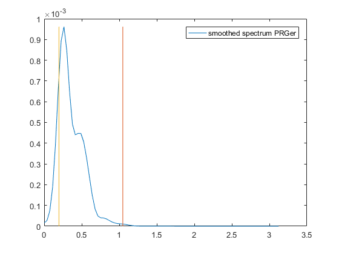

[](http://quantlet.de/)

## [](http://quantlet.de/) **SSM_spec2_d** [](http://quantlet.de/)

```yaml

Name of QuantLet: SSM_spec2_d

Published in: Linear Time Series With MATLAB and Octave

Description: 'The smoothed periodogram of the cycle of the quarterly German IPI series is computed
               and displayed.'

Keywords: time-series, smoothed periodogram, cycle, ARIMA model, canonical decomposition

Author: Víctor Gómez

Submitted: Fri, January 25 2019 by Víctor Gómez

```



### MATLAB Code
```matlab

%*****************************************************************
%
%    SPECTRAL ANALYSIS: GERMAN INDUSTRIAL PRODUCTION
%
% Series: German IPI cycle (quarterly data)
% Time span: 1970.Q1 - 2011.Q3
%*****************************************************************

clear;
clc;

y = load(fullfile('data', 'PRGer.dat'));
% Settings for spectral analysis:
per = 4; %number of seasons
win = 2; % Parzen window
corlag = 30;
graph = 1;
vnames = {'German IPI'};

spr = spectralan(y, per, win, corlag, graph, vnames);

```

automatically created on 2019-02-11