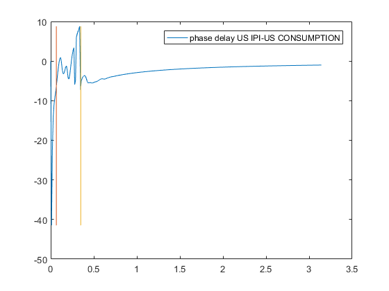
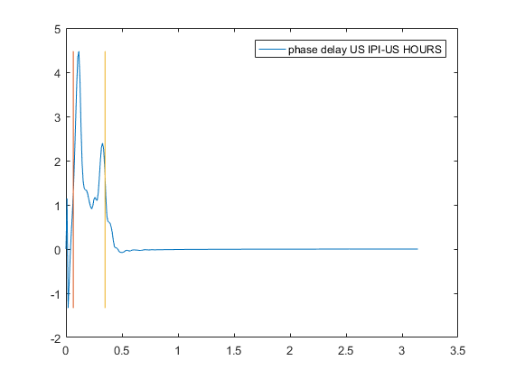

[](http://quantlet.de/)

## [](http://quantlet.de/) **SSM_spec3_d** [](http://quantlet.de/)

```yaml

Name of QuantLet: SSM_spec3_d

Published in: Linear Time Series With MATLAB and Octave

Description: 'A spectral analysis of three series is performed to see if two of them lead or lag
              the third one.'

Keywords: time-series, smoothed periodogram, cycle, spectral analysis, autocorrelations

Author: Víctor Gómez

Submitted: Fri, January 25 2019 by Víctor Gómez

```





### MATLAB Code
```matlab

%*****************************************************************
%
%    SPECTRAL ANALYSIS: US INDUSTRIAL PRODUCTION, CONSUMPTION AND HOURS
%
% Series: Cycles of the US IPI, consumption and working hours (monthly data)
% Time span: 1953.M4 - 2007.M9
%*****************************************************************

clear;
clc;

y = load(fullfile('data', 'USc3.dat'));
% Settings for spectral analysis:
per = 12; %number of seasons
win = 2; %Parzen window
corlag = 40; %number of correlation and cross correlations
graph = 1; %plot results
vnames = {'US IPI', 'US CONSUMPTION', 'US HOURS'}; %names for the series

spr = spectralan(y, per, win, corlag, graph, vnames);

```

automatically created on 2019-02-11