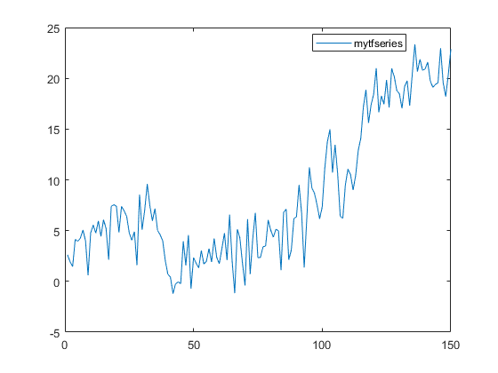
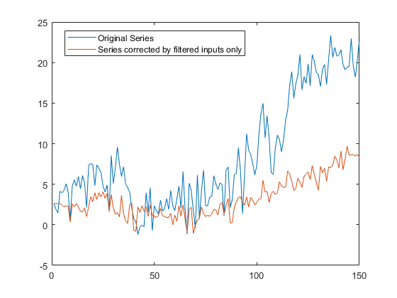
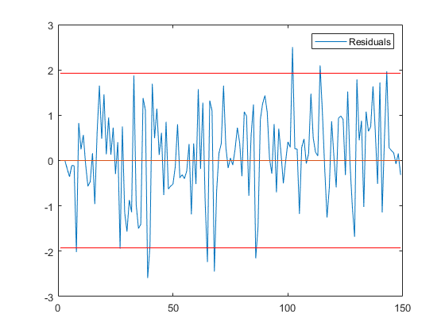
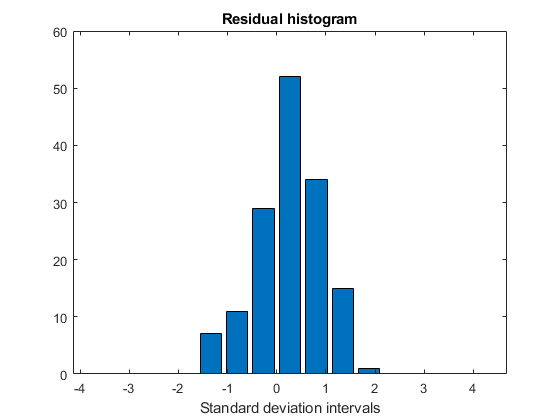
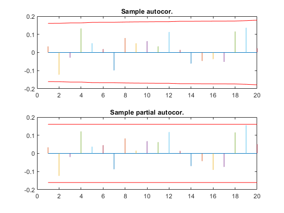
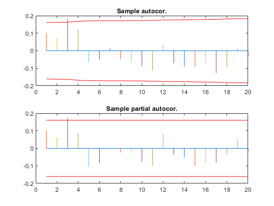

[](http://quantlet.de/)

## [](http://quantlet.de/) **SSM_tfsimul2_d** [](http://quantlet.de/)

```yaml

Name of QuantLet: SSM_tfsimul2_d

Published in: Linear Time Series With MATLAB and Octave

Description: 'Firstly, a time series following a transfer function model with one input is simulated. Then, the model is identified and estimated.'

Keywords: time-series, transfer function model, simulation, estimation, automatic model identification

Author: Víctor Gómez

Submitted: Wed, December 19 2018 by Víctor Gómez

```













### MATLAB Code
```matlab

% script file to simulate a series that follows a transfer function model.
%The input series is assumed to follow an ARIMA model. The model is
%
%  y_t =            u_t           +               v_t
%      =   (3.0B - 2.0B^2)x_t     +        (1 - 0.7B)/(1-B)A_t
%
% where x_t follows the model
%
% x_t = 1/(1-B)b_t
%
% and std(a_t) = 1. and std(b_t)=sqrt(.5).
%

clear

freq = 1;

x = arimasimeasy(freq, '[p dr q]', [0, 1, 0], 'N', 150, 'discard', ...
    50, 'seed', 18, 'stda', sqrt(.5), 'gft', 0);


v = arimasimeasy(freq, '[p dr q]', [0, 1, 1], 'thr', [-.7, 1], 'N', 150, 'discard', ...
    50, 'seed', 20, 'stda', 1., 'gft', 0);

%third, filter inputs by Phi(B)^{-1}Gamma(B)
%1) without the input model
thp = [-2., 3., 0.];
phip = 1.;

u01 = varmafilp(x, phip, thp);

omega(:, :, 1) = 0.;
omega(:, :, 2) = 3.;
omega(:, :, 3) = -2.;
delta(:, :, 1) = 1.;
u02 = varmafilp(x, delta, omega);

%2) with the input model
%set up state space form for input model
phix = [-1., 1.];
Phix = 1.;
Thx = 1.;
thx = 1.;
Sigma = .5;
u1 = varmafilp(x, phip, thp, phix, thx, Phix, Thx, Sigma, freq);

phi(:, :, 1) = 1;
phi(:, :, 2) = -1.;
Phi(:, :, 1) = 1;
Th(:, :, 1) = 1.;
th(:, :, 1) = 1.;
u2 = varmafilp(x, delta, omega, phi, th, Phi, Th, Sigma, freq);

u = u2;

y = v + u;

% y(6:10)=NaN(5,1);     we add some missing values

% out=arimaeasy(x,freq,'pr',1,'gft',1,'sname','myseries');
% out=arimaeasy(v,freq,'pr',1,'gft',1,'sname','myseries');

%Identify and estimate the model
out = tfeasy(y, x, freq, 'gft', 1, 'sname', 'mytfseries', 'tfident', 1, ...
             'autmid', 1);

```

automatically created on 2019-02-11