[](http://quantlet.de/)

## [](http://quantlet.de/) **SSM_usmsimul_d** [](http://quantlet.de/)

```yaml

Name of QuantLet: SSM_usmsimul_d

Published in: Linear Time Series With MATLAB and Octave

Description: 'Firstly, a time series following structural model is simulated. Then, the model is estimated.'

Keywords: time-series, structural model, simulation, estimation, unobserved components

Author: Víctor Gómez

Submitted: Mon, December 17 2018 by Víctor Gómez

```

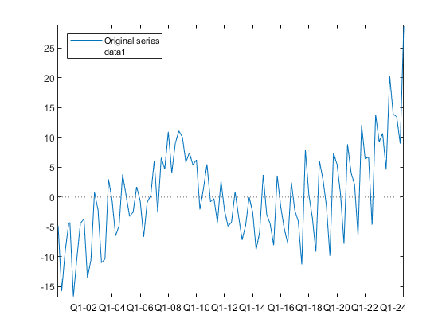

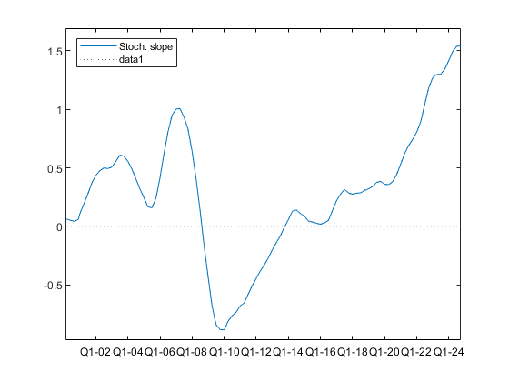

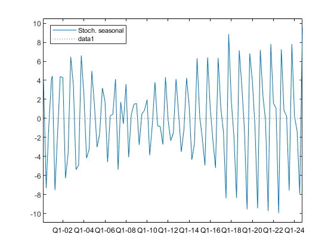

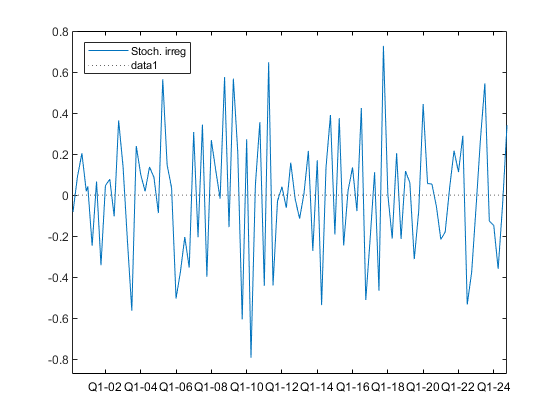

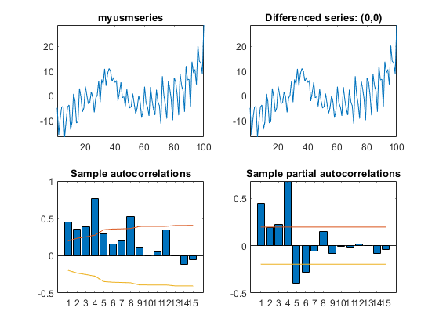

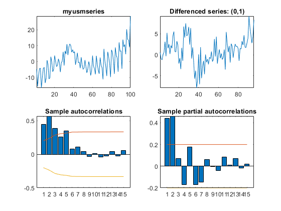

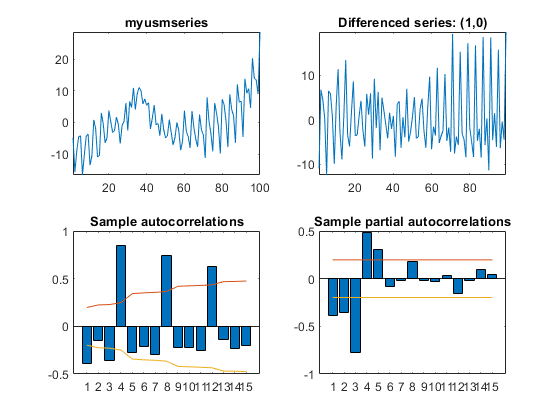

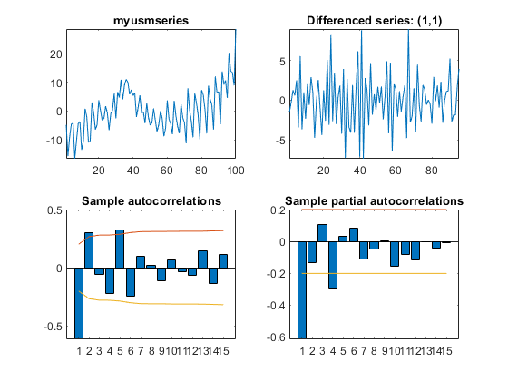

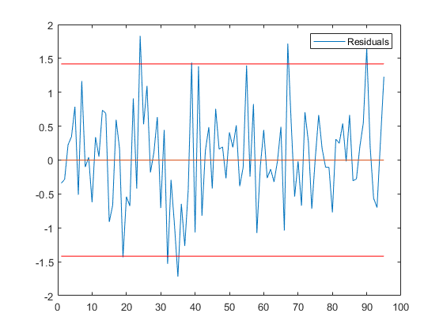

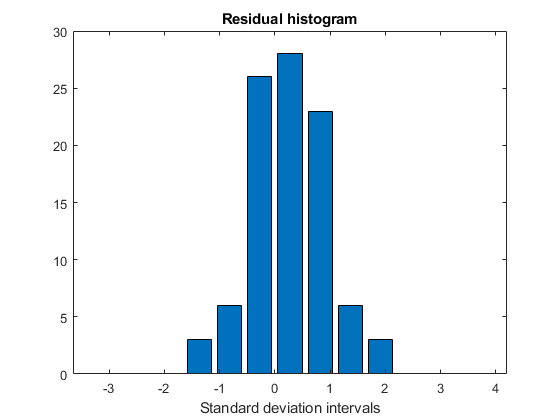

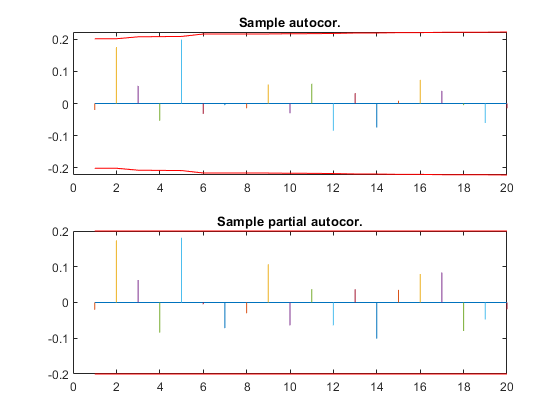

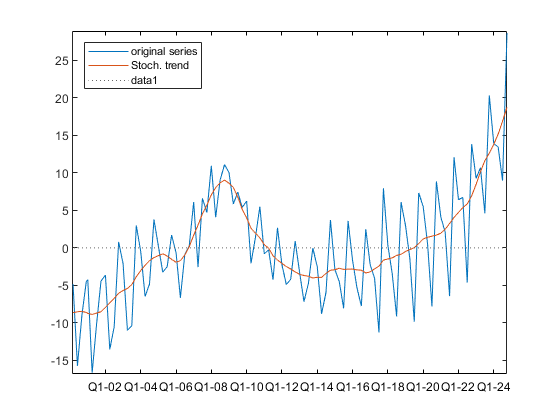

### MATLAB Code
```matlab

% script file to simulate a series that follows a univaariate transfer
% function model.
% The series is assumed to follow the basic structural model
%
%  y_t =    p_t + s_t + e_t,
%
% where p_t follows the model
%
% p_t = (1 - .7B)/(1-B)^2a_t
%
% with std(a_t) = 1. , s_t = s_{1,t} + s_{2,t} is such that
%
% s_{1,t} = (1 - .5B)/(1 + B^2)b_t,
%
% s_{2,t} = 1/(1+B)c_t,
%
% with stda(b_t) = stda(c_t) = .5,
%
% and e_t is iid normal with zero mean and stda .7
%

clear

freq = 1;

p = arimasimeasy(freq, '[p dr q]', [0, 2, 1], 'thr', [-.7, 1], 'N', 100, 'discard', ...
    50, 'seed', 18, 'stda', 1., 'gft', 0);

s1 = arimasimeasy(freq, '[p dr q]', [2, 0, 1], 'phir', [1, 0, 1], 'thr', [-.5, 1], ...
    'N', 100, 'discard', 50, 'seed', 19, 'stda', .71, 'gft', 0);

s2 = arimasimeasy(freq, '[p dr q]', [1, 0, 0], 'phir', [1, 1], 'N', 100, 'discard', ...
    50, 'seed', 20, 'stda', .5, 'gft', 0);


e = arimasimeasy(freq, '[p dr q]', [1, 0, 0], 'phir', [0, 1], 'N', 100, 'discard', ...
    50, 'seed', 21, 'stda', .7, 'gft', 0);


y = p + s1 + s2 + e;


%Identify and estimate the model
freq = 4;
out = usmeasy(y, freq, 'pr', 1, 'gft', 1, 'sname', 'myusmseries', 'level', ...
    [1, 0.1, NaN], 'slope', [1, 0.1, NaN], 'seas', [2, 0.1, NaN], ...
    'irreg', [1, 0.1, NaN]);

```

automatically created on 2019-02-11