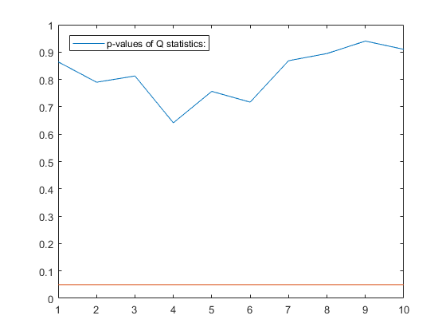

[](http://quantlet.de/)

## [](http://quantlet.de/) **SSM_varmasimul3_d** [](http://quantlet.de/)

```yaml

Name of QuantLet: SSM_varmasimul3_d

Published in: Linear Time Series With MATLAB and Octave

Description: 'Firstly, a normally distributed white noise is simulated. Then, the Portmanteau statistic is computed for several lags.'

Keywords: time-series, white noise, simulation, Portmanteau statistic, p-values

Author: Víctor Gómez

Submitted: Wed, December 19 2018 by Víctor Gómez


```



### MATLAB Code
```matlab

%script file to simulate a VARMA model
%
% Let the VARMA model be
%
%   Phi(B) y_t = Theta(B) a_t,
%
% where B is the backshift operator, By_t = y_{t-1}.
%
clear

l = 50;    %number of initial observations to be discarded in the
           %simulated series
N = 300;   %number of observations of the simulated series
s = 3;     %number of outputs
seed = 20; %this is to always generate the same series

%polynomial matrices Phi and Theta
Phi(:, :, 1) = eye(s);
Theta(:, :, 1) = eye(s);
%we add the following term to pretend we simulate a VARMA model, but
%in fact we are simulating white noise
Phi(:, :, 2) = zeros(s);

%covariance matrix of the a_t innovartions
S = [2.0, 0.5, 0.; 0.5, 1.0, 0.; 0., 0., .3];

%simulate v_t
[v, ferror] = varmasim(l, N, Phi, Theta, S, seed);

%ccm matrices
lag = 10;
ic = 1;
nr = 0;
str = mautcov(v, lag, ic, nr);
disp('Correlation matrix at lag 0:')
disp(str.r0)
disp('Q statistics:')
disp(str.qstat)

disp('p-values of Q statistics:')
disp(str.pval)
[m, n] = size(str.pval);
t = 1:m;
plot(t, str.pval, t, 0.05*ones(1, m))
legend('p-values of Q statistics:')

```

automatically created on 2019-02-11