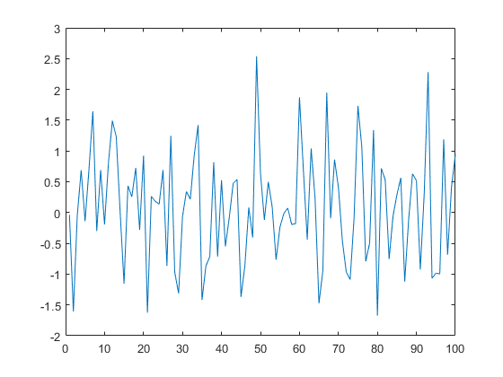

[](http://quantlet.de/)

## [](http://quantlet.de/) **SSM_whitenoise_d** [](http://quantlet.de/)

```yaml

Name of QuantLet: SSM_whitenoise_d

Published in: Linear Time Series With MATLAB and Octave

Description: 'A white noise series with 100 observations normally distributed with zero mean and unit variance is simulated.'

Keywords: time-series, white noise, normal distribution, variance, simulation

Author: Víctor Gómez

Submitted: Wed, December 19 2018 by Víctor Gómez

```



### MATLAB Code
```matlab

% script file to simulate a white noise series with 100 observations
% normally distributed with zero mean and unit variance

y = randn(100,1);
plot(y)

```

automatically created on 2019-02-11